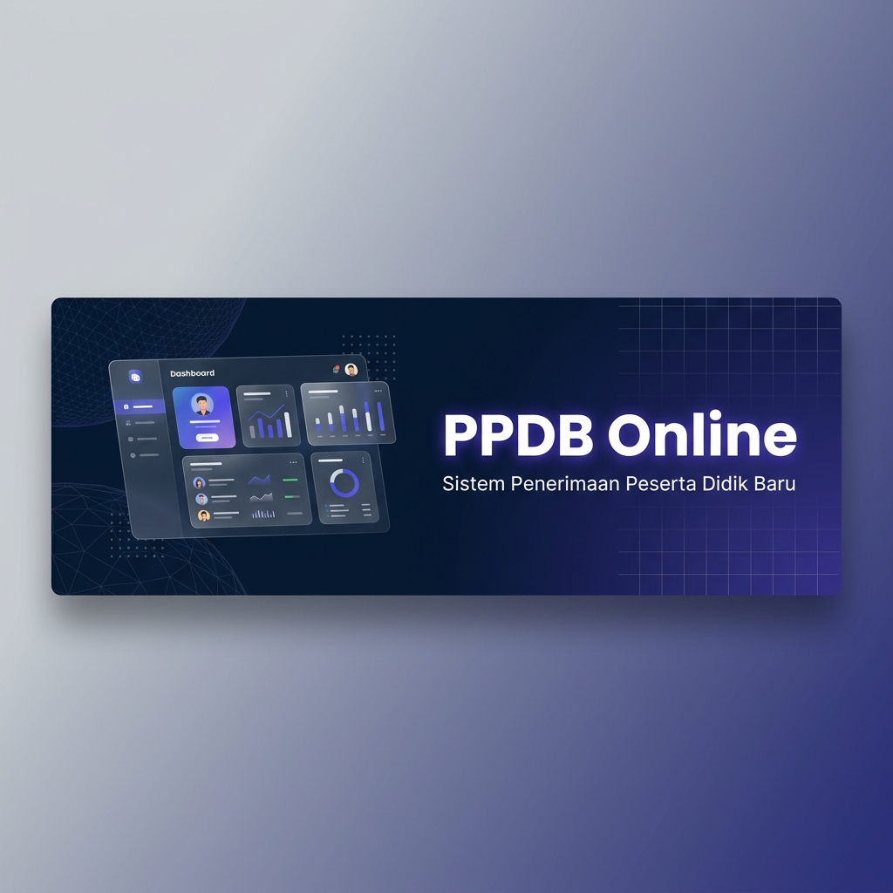
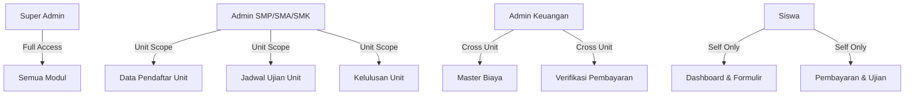
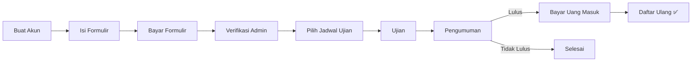

<p align="center">
  
</p>

<h1 align="center">PPDB Online</h1>

<p align="center">
  <strong>Sistem Penerimaan Peserta Didik Baru — Modern, Cepat & Fleksibel</strong>
</p>

<p align="center">
  <a href="#"></a>
  <a href="#"></a>
  <a href="#"></a>
  <a href="#"></a>
  <a href="#"></a>
</p>

<p align="center">
  Platform manajemen penerimaan siswa baru yang dirancang khusus untuk yayasan pendidikan multi-jenjang (SMP, SMA, SMK). Dibangun dengan teknologi terkini, tampilan premium, dan arsitektur yang scalable.
</p>

---

## ✨ Mengapa PPDB Online?

| | Fitur | Keterangan |
|---|---|---|
| 🏫 | **Multi-Unit** | Satu instalasi untuk mengelola pendaftaran SMP, SMA, dan SMK secara bersamaan |
| 🎨 | **Tema Dinamis** | 5 warna aksen & 4 background tema yang bisa dipilih setiap pengguna |
| ⚙️ | **Konfigurasi Penuh** | Nama aplikasi, logo, footer, meta SEO — semua bisa diubah dari dashboard |
| 📱 | **Responsive** | Tampilan optimal di desktop, tablet, dan smartphone |
| 📄 | **PDF Generator** | Kartu ujian & Surat Keterangan Lulus otomatis dalam format PDF |
| 💬 | **Integrasi WhatsApp** | Tombol bantuan langsung terhubung ke panitia setiap unit |
| 🔐 | **Role-Based Access** | 6 role berbeda dengan hak akses yang terkontrol ketat |

---

## 🖥️ Demo & Preview

### 🔑 Akun Demo (Setelah Seeding)

| Role | Email | Password |
|---|---|---|
| Super Admin | `admin@ppdb.com` | `password` |
| Admin SMP | `admin.smp@ppdb.com` | `password` |
| Admin SMA | `admin.sma@ppdb.com` | `password` |
| Admin SMK | `admin.smk@ppdb.com` | `password` |
| Admin Keuangan | `admin.adm@ppdb.com` | `password` |
| Siswa | *(Daftar melalui form registrasi)* | — |

---

## 🏗️ Arsitektur & Fitur Lengkap

### 📋 Modul Siswa (Student Portal)

- **Dashboard Interaktif** — Ringkasan status pendaftaran dengan progress timeline
- **Formulir Pendaftaran** — Form multi-step dengan validasi real-time
- **Administrasi Keuangan** — Upload bukti pembayaran & tracking status verifikasi
- **Kartu Ujian Digital** — Download kartu ujian dalam format PDF setelah terverifikasi
- **Pengumuman Kelulusan** — Cek status kelulusan & download SKL (Surat Keterangan Lulus)
- **Pusat Bantuan** — WhatsApp shortcut langsung ke panitia unit terkait

### 🛡️ Modul Admin Unit (SMP/SMA/SMK)

- **Dashboard Statistik** — Data realtime pendaftar per gelombang & status
- **Manajemen Pendaftar** — Lihat detail, edit data, dan kelola status siswa
- **Jadwal Ujian** — Buat & atur sesi ujian (tanggal, waktu, kuota)
- **Manajemen Kelulusan** — Update status kelulusan massal (bulk action) dengan deadline daftar ulang

### 💰 Modul Admin Keuangan

- **Master Biaya** — Atur jenis & nominal biaya per jenjang pendidikan (sortable)
- **Verifikasi Pembayaran** — Approve/reject bukti bayar dengan catatan admin

### 👑 Modul Super Admin

- **Tahun Ajaran** — Kelola periode akademik dengan toggle aktif/non-aktif
- **Manajemen Jenjang** — CRUD unit pendidikan + kontak WhatsApp per unit
- **Gelombang Pendaftaran** — Atur gelombang dengan rentang tanggal & status
- **Manajemen Admin** — CRUD akun admin semua role
- **Pengaturan Global** — Ubah nama aplikasi, logo, deskripsi meta & footer

---

## 🧱 Tech Stack

```
Backend       → Laravel 13 (PHP 8.3+)
Frontend      → Blade + Tailwind CSS + Alpine.js
Database      → MySQL / MariaDB
PDF Engine    → Barryvdh DomPDF
Auth          → Laravel Breeze
Build Tool    → Vite
Testing       → Pest PHP
```

---

## 🚀 Instalasi

### Prasyarat

- PHP ≥ 8.3
- Composer ≥ 2.x
- Node.js ≥ 18.x & npm
- MySQL / MariaDB
- Git

### Langkah Instalasi

```bash
# 1. Clone repository
git clone https://gitlab.com/ekozawa72/ppdb-app.git
cd ppdb-app

# 2. Install dependencies
composer install
npm install

# 3. Setup environment
cp .env.example .env
php artisan key:generate

# 4. Konfigurasi database di file .env
# DB_DATABASE=ppdb_app
# DB_USERNAME=root
# DB_PASSWORD=

# 5. Jalankan migrasi & seeder
php artisan migrate
php artisan db:seed --class=SuperAdminSeeder

# 6. Buat symbolic link untuk storage
php artisan storage:link

# 7. Build assets & jalankan server
npm run build
php artisan serve
```

Buka browser di `http://localhost:8000` dan login dengan akun Super Admin.

### ⚡ Mode Development (Concurrent)

```bash
composer dev
```

Perintah ini menjalankan **4 proses sekaligus**: Laravel server, Queue listener, Log viewer (Pail), dan Vite dev server.

---

## 📁 Struktur Proyek

```
ppdb-app/
├── app/
│   ├── Http/Controllers/
│   │   ├── Admin/                    # Controller admin (Student, Financial, Setting, dll)
│   │   ├── Auth/                     # Authentication controllers (Breeze)
│   │   └── RegistrationController    # Controller utama siswa
│   ├── Models/                       # Eloquent models (User, Registration, Payment, dll)
│   ├── Scopes/                       # Global Scope (ActiveAcademicYearScope)
│   └── Traits/                       # Reusable traits (HasActiveAcademicYear)
├── database/
│   ├── migrations/                   # Schema migrasi database
│   └── seeders/                      # Data seeder (SuperAdminSeeder)
├── resources/views/
│   ├── admin/                        # Views admin (dashboard, students, financial, dll)
│   ├── auth/                         # Views autentikasi (login, register)
│   ├── layouts/                      # Layout utama + partials navigasi
│   │   └── partials/                 # nav-siswa, nav-admin, nav-super-admin
│   ├── pdf/                          # Template PDF (kartu ujian, SKL)
│   └── pendaftaran/                  # Views modul pendaftaran siswa
├── routes/
│   ├── web.php                       # Route utama aplikasi
│   └── auth.php                      # Route autentikasi
└── public/
    └── storage/                      # Symlink ke storage (logo, bukti bayar)
```

---

## 🔐 Sistem Role & Hak Akses



| Role | Kode | Akses |
|---|---|---|
| Super Admin | `super_admin` | Semua modul + konfigurasi sistem |
| Admin SMP | `admin_smp` | Data pendaftar, jadwal & kelulusan unit SMP |
| Admin SMA | `admin_sma` | Data pendaftar, jadwal & kelulusan unit SMA |
| Admin SMK | `admin_smk` | Data pendaftar, jadwal & kelulusan unit SMK |
| Admin Keuangan | `admin_administrasi` | Master biaya & verifikasi pembayaran |
| Siswa | `siswa` | Dashboard, formulir, pembayaran, kartu ujian |

---

## ⚙️ Konfigurasi Dinamis

Semua konfigurasi berikut dapat diubah langsung dari **Dashboard Super Admin** tanpa perlu mengubah kode:

| Setting | Key | Default |
|---|---|---|
| Nama Aplikasi | `app_name` | PPDB Online |
| Logo Aplikasi | `app_logo` | SVG Icon |
| Deskripsi Meta | `meta_description` | Sistem PPDB Online... |
| Teks Footer | `footer_copyright` | © 2026 Yayasan... |
| Kontak WhatsApp | `contact_whatsapp`* | *(per unit)* |

> \* Kontak WhatsApp diatur per jenjang di menu **Manajemen Jenjang**, bukan di pengaturan global.

---

## 📝 Alur Pendaftaran Siswa



1. **Registrasi** — Siswa membuat akun dan memilih unit tujuan (SMP/SMA/SMK)
2. **Formulir** — Mengisi data diri lengkap (biodata, orang tua, asal sekolah, dll)
3. **Pembayaran** — Upload bukti transfer biaya formulir, menunggu verifikasi admin
4. **Jadwal Ujian** — Memilih sesi ujian yang tersedia setelah pembayaran diverifikasi
5. **Kartu Ujian** — Download kartu ujian dalam format PDF
6. **Pengumuman** — Cek status kelulusan & download SKL jika lulus
7. **Daftar Ulang** — Bayar uang masuk sebelum deadline yang ditentukan

---

## 🤝 Kontribusi

Kontribusi sangat diterima! Silakan fork repository ini dan buat Pull Request.

```bash
# Fork & clone
git clone https://gitlab.com/your-username/ppdb-app.git

# Buat branch fitur
git checkout -b feature/fitur-baru

# Commit & push
git commit -m "feat: tambah fitur baru"
git push origin feature/fitur-baru

# Buat Merge Request di GitLab
```

### Pedoman Kontribusi

- Gunakan **conventional commits** (`feat:`, `fix:`, `docs:`, dll)
- Pastikan kode lolos `php artisan test` sebelum submit
- Ikuti style guide **Laravel Pint** (`./vendor/bin/pint`)

---

## 📄 Lisensi

Proyek ini dilisensikan di bawah [MIT License](LICENSE) — bebas digunakan untuk keperluan pribadi maupun komersial.

---

<p align="center">
  Dibuat dengan ❤️ untuk kemajuan pendidikan Indonesia
</p>
