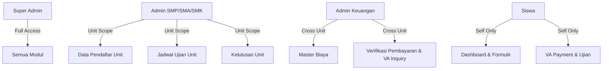
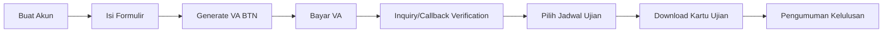

<p align="center">
  
</p>

<h1 align="center">PPDB Online</h1>

<p align="center">
  <strong>Sistem Penerimaan Peserta Didik Baru — Modern, Cepat & Terintegrasi Bank BTN</strong>
</p>

<p align="center">
  <a href="#"></a>
  <a href="#"></a>
  <a href="#"></a>
  <a href="#"></a>
  <a href="#"></a>
</p>

<p align="center">
  Platform manajemen penerimaan siswa baru yang dirancang khusus untuk yayasan pendidikan multi-jenjang (SMP, SMA, SMK). Dibangun dengan teknologi terkini, tampilan premium, arsitektur scalable, dan integrasi pembayaran <strong>Virtual Account Bank BTN</strong>.
</p>

---

## ✨ Mengapa PPDB Online?

| | Fitur | Keterangan |
|---|---|---|
| 💳 | **Integrasi VA BTN** | Pembuatan Virtual Account otomatis (17 digit) untuk biaya pendaftaran & daftar ulang |
| 🔄 | **Auto-Verify** | Verifikasi pembayaran realtime melalui tombol "Cek Status" (Inquiry API) & Webhook Callback |
| 🏫 | **Multi-Unit** | Satu instalasi untuk mengelola pendaftaran SMP, SMA, dan SMK secara bersamaan |
| 🎨 | **Tema Dinamis** | 5 warna aksen & 4 background tema yang bisa dipilih setiap pengguna |
| ⚙️ | **Konfigurasi Penuh** | Nama aplikasi, logo, footer, meta SEO — semua bisa diubah dari dashboard |
| 📊 | **DataTables** | Tabel interaktif dengan fitur search, ordering, dan paging untuk manajemen peserta |
| 🔐 | **Role-Based Access** | 6 role berbeda dengan isolasi data unit yang ketat (SMA, SMK, SMP) |

---

## 🖥️ Demo & Preview

### 🔑 Akun Demo (Setelah Seeding)

| Role | Email | Password |
|---|---|---|
| Super Admin | `admin@ppdb.com` | `password` |
| Admin SMP | `admin.smp@ppdb.com` | `password` |
| Admin SMA | `admin.sma@ppdb.com` | `password` |
| Admin SMK | `admin.smk@ppdb.com` | `password` |
| Admin Keuangan | `admin.adm@ppdb.com` | `password` |
| Siswa | *(Daftar melalui form registrasi)* | — |

---

## 🏗️ Arsitektur & Fitur Lengkap

### 📋 Modul Siswa (Student Portal)

- **Dashboard Interaktif** — Ringkasan status pendaftaran dengan progress timeline
- **Formulir Pendaftaran** — Form multi-step dengan validasi real-time
- **Administrasi Keuangan (VA BTN)** — Generate nomor VA dinamis dan cek status pelunasan secara realtime (Inquiry)
- **Kartu Ujian Digital** — Download kartu ujian dalam format PDF setelah terverifikasi
- **Pengumuman Kelulusan** — Cek status kelulusan & download SKL (Surat Keterangan Lulus)
- **Pusat Bantuan** — WhatsApp shortcut langsung ke panitia unit terkait

### 🛡️ Modul Admin Unit (SMP/SMA/SMK)

- **Dashboard Statistik** — Data realtime pendaftar per gelombang & status
- **Manajemen Pendaftar** — Lihat detail, edit data, dan kelola status siswa (Terisolasi per unit)
- **Jadwal Ujian** — Buat sesi ujian dengan relasi jenjang yang spesifik (e.g. SMK TKJ)
- **Verifikasi VA** — Tombol "Cek Status VA" khusus untuk memverifikasi pembayaran melalui API BTN secara langsung
- **Pindah Jenjang** — Fitur transfer siswa antar unit (e.g. SMA ke SMK) dengan satu klik
- **Manajemen Kelulusan** — Update status kelulusan massal (bulk action) dengan deadline daftar ulang

### 💰 Modul Admin Keuangan

- **Master Biaya** — Atur jenis & nominal biaya per jenjang pendidikan (sortable)
- **Verifikasi Global** — Akses verifikasi pembayaran (Manual & VA) untuk seluruh unit (SMP, SMA, SMK)
- **Callback Listener** — Endpoint `/api/btn/callback` untuk menerima notifikasi pelunasan otomatis dari Bank

### 👑 Modul Super Admin

- **Tahun Ajaran** — Kelola periode akademik dengan toggle aktif/non-aktif
- **Manajemen Jenjang** — CRUD unit pendidikan + kontak WhatsApp per unit
- **Gelombang Pendaftaran** — Atur gelombang dengan rentang tanggal & status
- **Manajemen Admin** — CRUD akun admin semua role
- **Backup & Restore** — Ekspor/Impor database (SQL) dan arsip bukti pembayaran (ZIP)
- **Pengaturan Global** — Ubah nama aplikasi, logo, deskripsi meta & footer

---

## 🧱 Tech Stack

```
Backend       → Laravel 13 (PHP 8.2+)
Frontend      → Blade + Tailwind CSS 4 + Alpine.js
Database      → MySQL / MariaDB
VA Integration→ Bank BTN Legacy API (Signature SHA-256)
PDF Engine    → Barryvdh DomPDF
Auth          → Laravel Breeze
Build Tool    → Vite
```

---

## 🚀 Instalasi

### Prasyarat

- PHP ≥ 8.2
- Composer ≥ 2.x
- Node.js ≥ 18.x & npm
- MySQL / MariaDB

### Langkah Instalasi

```bash
# 1. Clone repository
git clone https://gitlab.com/ekozawa72/ppdb-app.git
cd ppdb-app

# 2. Install dependencies
composer install
npm install

# 3. Setup environment
cp .env.example .env
php artisan key:generate

# 4. Konfigurasi .env (Database & BTN)
# BT_ID=your_id
# BTN_KEY=your_key
# BTN_SECRET=your_secret
# BTN_KODE_INSTITUSI=4842

# 5. Jalankan migrasi & seeder
php artisan migrate
php artisan db:seed --class=DatabaseSeeder      # Data Master
php artisan db:seed --class=DummyDataSeeder    # Opsional: 1000 data siswa dummy

# 6. Buat symbolic link untuk storage
php artisan storage:link

# 7. Build assets & jalankan server
npm run build
php artisan serve
```

### ⚡ Mode Development (Concurrent)

```bash
composer dev
```

Perintah ini menjalankan **4 proses sekaligus**: Laravel server, Queue listener, Log viewer (Pail), dan Vite dev server.

---

## 📁 Struktur Proyek

```
ppdb-app/
├── app/
│   ├── Http/Controllers/
│   │   ├── Admin/                    # Controller admin (Student, Financial, Setting, dll)
│   │   ├── Api/                      # Controller Callback API (BtnCallbackController)
│   │   └── RegistrationController    # Controller utama siswa + Inquiry VA logic
│   ├── Services/                     # Service Layer (BtnService untuk integrasi bank)
│   ├── Models/                       # Eloquent models (User, Registration, Payment, dll)
│   └── ...
├── database/
│   ├── migrations/                   # Schema migrasi database (termasuk VA fields)
│   └── seeders/                      # Data seeder (DummyDataSeeder 1000 siswa)
├── resources/views/
│   ├── admin/                        # Views admin (dashboard, students, financial, dll)
│   └── pendaftaran/                  # Views modul pendaftaran siswa (VA workflow)
└── ...
```

---

## 🔐 Sistem Role & Hak Akses



---

## 📝 Alur Pendaftaran Siswa (VA Flow)



1. **Registrasi** — Siswa membuat akun dan memilih unit tujuan (SMP/SMA/SMK)
2. **Formulir** — Mengisi data diri lengkap (biodata, orang tua, asal sekolah, dll)
3. **Pembayaran VA** — Menekan tombol "Bayar via VA BTN" untuk mendapatkan nomor VA 17-digit
4. **Verifikasi** — Pembayaran diverifikasi secara otomatis melalui Inquiry API atau Webhook Callback
5. **Ujian** — Memilih sesi ujian dan mendownload Kartu Ujian (PDF)
6. **Hasil** — Cek status kelulusan & download SKL jika dinyatakan Lulus

---

## 🤝 Kontribusi

Kontribusi sangat diterima! Silakan fork repository ini dan buat Pull Request.

---

## 📄 Lisensi

Proyek ini dilisensikan di bawah [MIT License](LICENSE) — bebas digunakan untuk keperluan pribadi maupun komersial.

---

<p align="center">
  Dibuat dengan ❤️ untuk kemajuan pendidikan Indonesia
</p>
